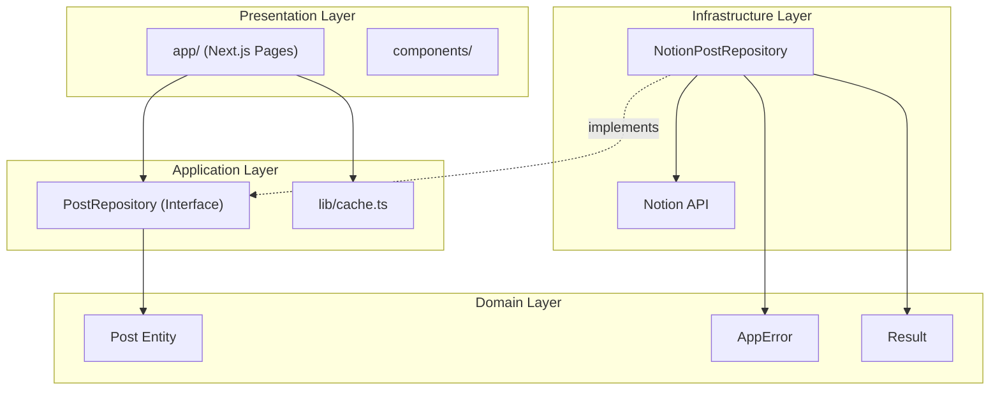

# 아키텍처 문서

> **대상**: `apps/blog` (tuum-prism 블로그 애플리케이션)

---

## 디렉토리 구조

```
src/
├── app/                    # Next.js App Router
│   ├── blog/[id]/          # 포스트 상세 페이지
│   │   ├── page.tsx        # RSC (Server Component)
│   │   ├── not-found.tsx   # 404 페이지
│   │   └── error.tsx       # 500 에러 페이지
│   ├── layout.tsx          # 공통 레이아웃
│   └── page.tsx            # 홈 (포스트 목록)
├── application/            # 유스케이스, Port 인터페이스
│   └── post/
│       └── post.repository.ts
├── domain/                 # 도메인 모델, 비즈니스 로직
│   ├── errors/             # 커스텀 에러 클래스
│   ├── post/               # Post 엔티티
│   └── result.ts           # Result 패턴
├── infrastructure/         # 외부 시스템 연동
│   └── notion/             # Notion API 구현
├── components/             # React 컴포넌트
│   ├── filter/             # 필터 컴포넌트
│   ├── layout/             # 레이아웃 컴포넌트
│   └── post/               # 포스트 컴포넌트
├── lib/                    # 유틸리티 함수
│   ├── cache.ts            # 메타데이터 캐싱
│   ├── reading-time.ts     # 읽기 시간 계산
│   └── toc-extractor.ts    # 목차 추출
└── styles/                 # 스타일 파일
```

---

## 레이어 구조



---

## 에러 핸들링

### Result 패턴

에러를 예외가 아닌 **값**으로 처리하여 타입 안전한 에러 핸들링을 구현합니다.

```typescript
// 사용 예시
const result = await postRepository.findById(id);

if (!result.success) {
  if (result.error.code === ErrorCode.NOT_FOUND) {
    notFound(); // 404 페이지
  }
  throw result.error; // error.tsx에서 처리
}

const post = result.data; // 타입 안전하게 Post 접근
```

### 에러 코드

| 코드 | HTTP 상태 | 설명 |
|------|-----------|------|
| `NOT_FOUND` | 404 | 리소스를 찾을 수 없음 |
| `UNAUTHORIZED` | 401 | 인증 오류 |
| `INTERNAL_ERROR` | 500 | 서버 내부 오류 |

---

## 성능 최적화

### 캐싱 전략

```typescript
// lib/cache.ts
export const getCachedMetadata = unstable_cache(
  async () => { /* 태그/시리즈 집계 */ },
  ['blog-metadata'],
  { revalidate: 300 } // 5분 캐시
);
```

### 서버 사이드 필터링

| 필터 유형 | 구현 위치 | 이유 |
|----------|----------|------|
| 태그 | Notion API | DB 수준 필터링 가능 |
| 시리즈 | Notion API | DB 수준 필터링 가능 |
| 검색어 | 클라이언트 | Notion API 미지원 |

---

## 접근성 (a11y)

### 키보드 네비게이션

| 키 | 동작 |
|---|------|
| `Tab` | 포커스 이동 |
| `Enter` | 선택/활성화 |
| `Escape` | 모달/드롭다운 닫기 |
| `↑` `↓` | 목차 항목 이동 |
| `Home` | 첫 항목으로 |
| `End` | 마지막 항목으로 |

### ARIA 속성

- `aria-current="location"`: 현재 활성 목차 항목
- `aria-expanded`: 드롭다운/모바일 목차 열림 상태
- `aria-controls`: 컨트롤과 대상 요소 연결
- `aria-label`: 스크린 리더용 레이블
